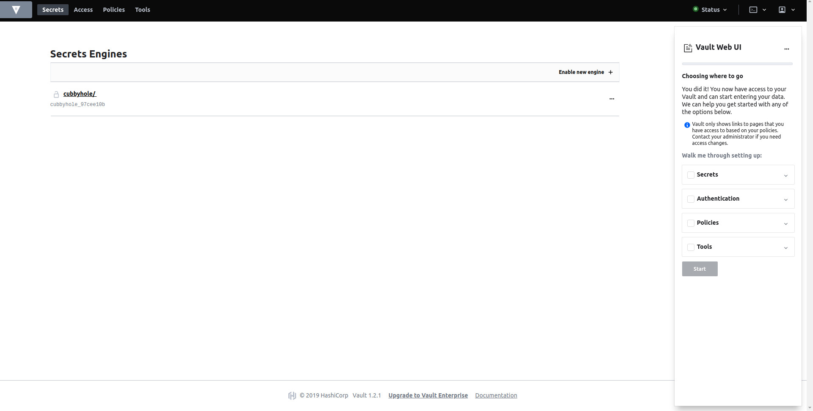

# Vault

## Pre-requisite

- Ubuntu
- Nginx
- Let's encrypt certbot with auto-renew
- unzip

## Deployment

You can following the offical documentation for deployment [here](https://learn.hashicorp.com/vault/getting-started/deploy)

### Installation

You can follow the steps in the official documentation [here](https://learn.hashicorp.com/vault/getting-started/install)

You can download it by running the following command

```sh
wget https://releases.hashicorp.com/vault/1.2.2/vault_1.2.2_linux_amd64.zip
```

Note the version of vault is 1.2.2 while writing this guide was 1.2.2.

Unzip the archive

```sh
unzip vault_1.2.2_linux_amd64.zip && mv vault /usr/local/bin/
```

Validate your installation

```sh
vault
```

You will be seeing the following ouput

```
Usage: vault <command> [args]

Common commands:
    read        Read data and retrieves secrets
    write       Write data, configuration, and secrets
    delete      Delete secrets and configuration
    list        List data or secrets
    login       Authenticate locally
    server      Start a Vault server
    status      Print seal and HA status
    unwrap      Unwrap a wrapped secret

Other commands:
    audit          Interact with audit devices
    auth           Interact with auth methods
    lease          Interact with leases
    operator       Perform operator-specific tasks
    path-help      Retrieve API help for paths
    policy         Interact with policies
    secrets        Interact with secrets engines
    ssh            Initiate an SSH session
    token          Interact with tokens
```

### Configuration

Assuming you have enabled ssl in your server using certbot. Hence we are running vault in ssl-disabled mode.

Create the following configuration file

```sh
mkdir $HOME/config and touch vault.config.hcl
```

Copy the following contents of the config file

```hcl
ui = true

storage "file" {
  path    = "/mnt/vault/data"
}

listener "tcp" {
  address     = "127.0.0.1:8200"
  tls_disable = 1
}
```

### Start

You can start the production server using the following command

```sh
nohup vault server -config=$HOME/config/vault.config.hcl &
```

### Initializing

Before you can use the application, you have to initialize the application. It provides the root key and other keys for [sealing and unsealing the vault](https://www.vaultproject.io/docs/concepts/seal.html)

```sh
vault operator init -address=http://127.0.0.1:8200
```

This will produce the following output

```
Unseal Key 1: 6EW6guk07BHML+Sl/3ed3K/CHqdVXtU6OsgQIMJvS8EQ
Unseal Key 2: dZePWkQRh3rXGoCtgJb8P7IH2KEW5ygdhRn6KULAC0yY
Unseal Key 3: PHKXAqsdaweGfVPzyItwrQKyiniOO42PF47vo1VCAKd/
Unseal Key 4: l+kdjBFX7IgNgNifYcay+KgiKTQEsgoxz8HMgiu1jJVg
Unseal Key 5: eoAfqIen9BayXuAjoO+sBKPPYWGoeXgb1X6T05eoqRHz

Initial Root Token: s.musyCuiinNFSXHrvHTOu7LXt

Vault initialized with 5 key shares and a key threshold of 3. Please securely
distribute the key shares printed above. When the Vault is re-sealed,
restarted, or stopped, you must supply at least 3 of these keys to unseal it
before it can start servicing requests.

Vault does not store the generated master key. Without at least 3 key to
reconstruct the master key, Vault will remain permanently sealed!

It is possible to generate new unseal keys, provided you have a quorum of
existing unseal keys shares. See "vault operator rekey" for more information.
```

Securely store these information. You will require these information while accessing the application

### Nginx configuration for pulic access

To access vault through UI. You need to configure the nginx to forward the requests to `127.0.0.1`. We had earlier configured the vault address to be `127.0.0.1`, hence we will just be adding a proxy pass in the nginx. You can add the following nginx configuration in `/etc/nginx/sites-enabled/default` file

```
server {
        listen 80 default_server;
        listen [::]:80 default_server;

        # SSL configuration
        #
        listen 443 ssl default_server;
        listen [::]:443 ssl default_server;

        # ....

        root /var/www/html;

        # Add index.php to the list if you are using PHP
        index index.html index.htm index.nginx-debian.html;

        server_name vault.cuttle.ai;
        ssl_certificate /etc/letsencrypt/live/vault.cuttle.ai/fullchain.pem;
        ssl_certificate_key /etc/letsencrypt/live/vault.cuttle.ai/privkey.pem;

        location / {
                # First attempt to serve request as file, then
                # as directory, then fall back to displaying a 404.
                 proxy_set_header Host $host;
                 proxy_set_header X-Real-IP $remote_addr;
                 proxy_pass http://127.0.0.1:8200;
                 proxy_http_version 1.1;
                 proxy_set_header Upgrade $http_upgrade;
                 proxy_set_header Connection "upgrade";
        }

        # ....

```

Restart the nginx using the command

```sh
service nginx restart
```

### Access the UI

You can now access the vault UI using the url :- `https://vault.cuttle.ai/ui` or `https://<your-public-ip>:8200/ui`
It will prompt to provide the unseal key. Provide any of the 3 unseal keys. Then you will be asked the token to login. You can either use root key or other login methods as per configured.
You can now see a UI as given below.


